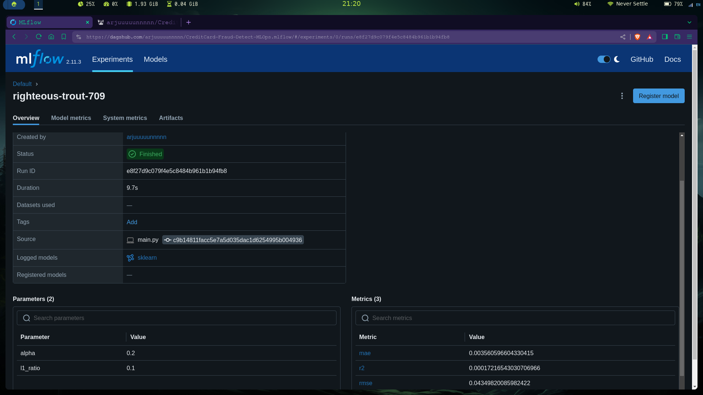

# A MLOps Project uses MLFlow, Dagshub

## Overview:
This is a MLOps (Machine Learning Operations) project that aims to detect credit card fraud. It utilizes `MLFlow` for tracking and evaluating models and `Dagshub` for managing the project's workflow


#### Usage:

clone this repo
```bash
git clone https://github.com/arjuuuuunnnnn/CreditCard-Fraud-Detect-MLOps.git
```

#### create env 
```bash
conda create -n cred python=3.8 -y
```

#### activate env
```bash
conda activate cred
```

#### install dependencies
```bash
pip install -r requirements.txt
```

#### Finally
```bash
python main.py
```
### UI
```bash
python app.py
```


### Dagshub integration:
[https://dagshub.com/arjuuuuunnnnn/CreditCard-Fraud-Detect-MLOps](https://dagshub.com/arjuuuuunnnnn/CreditCard-Fraud-Detect-MLOps)

### dagshub config
To configure Dagshub in the model evaluation file, include the following code:

```bash
import dagshub
dagshub.init(repo_owner='arjuuuuunnnnn', repo_name='CreditCard-Fraud-Detect-MLOps', mlflow=True)

import mlflow
with mlflow.start_run():
  mlflow.log_param('parameter name', 'value')
  mlflow.log_metric('metric name', 1)
```

### Any bugs?
If you encounter any bugs or issues while using the project, feel free to open an issue


